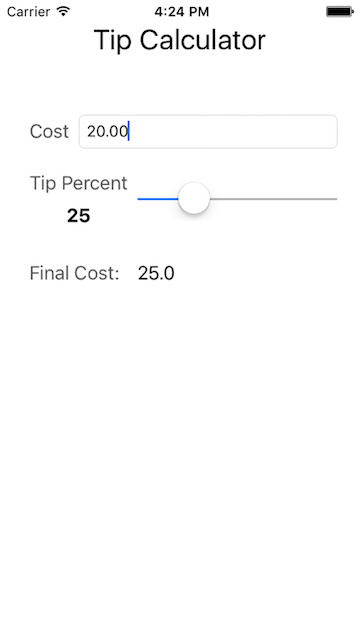

# TipCalculator
A simple tip calculator iOS app based on tutorial at www.weheartswift.com.  Goal is to practice building interfaces in Xcode and connecting interface elements to code.

## Concepts Used/Practiced
* Interface Builder in Xcode 7
* Creating labels, text fields, and sliders
* Connecting interface elements to View Controller
* Refactoring duplicated code into a function

## Attributions
* [Getting Started With iOS Programming: Tip Calculator App](https://www.weheartswift.com/getting-started-with-ios-programming/)
